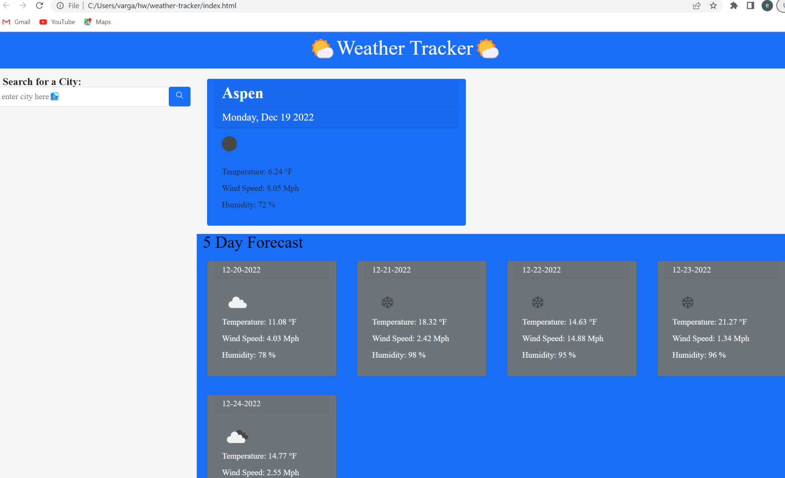

# WEATHER-TRACKER

## Description
In this assignment we had to use apis and generate a key to be able to use there data. once key was generated the website would allow you pull its weather info. This project i made a weather app to let you input a city and show you todays weather and the next five day forcat.

## Links
https://github.com/e-varg24/weather-tracker.git

https://e-varg24.github.io/weather-tracker/

## Built With
html
css
javascript
day.js
bootstrap